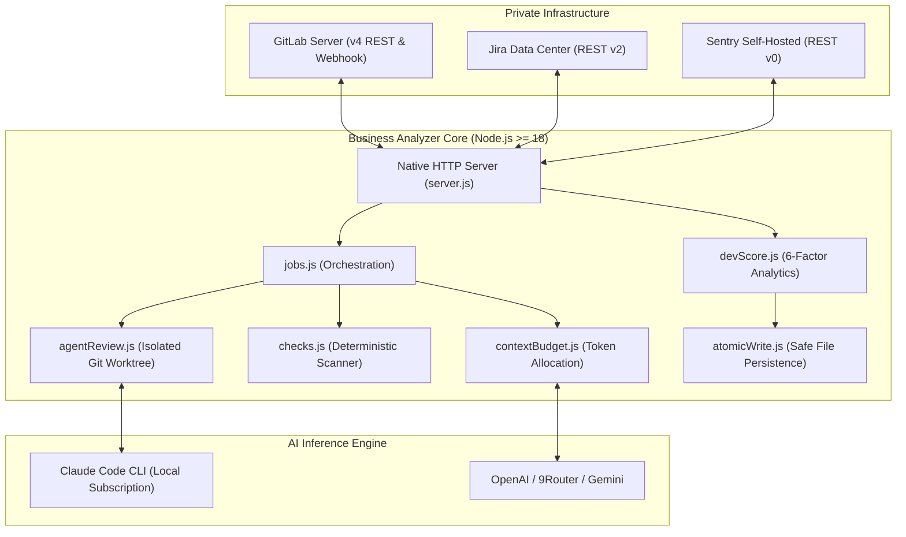

# 🚀 Business Analyzer

<div align="center">

**Autonomous AI Code Review & Engineering Team Intelligence for GitLab, Jira, and Sentry.**  
*Self-hosted. Zero external npm dependencies. 100% private to your infrastructure.*

[](package.json)
[](tests/)
[](docs/ARCHITECTURE.md)
[](package.json)
[](https://nodejs.org/)

[**Explore Interactive Demo**](#-try-it-in-60-seconds-demo-mode) • [**Visual Tour**](docs/VISUAL_TOUR.md) • [**Architecture**](docs/ARCHITECTURE.md) • [**Product Strategy**](docs/PRODUCT_STRATEGY.md) • [**Commercial Advisory**](#-creator--commercial-advisory)

</div>

---

## ⚡ What is Business Analyzer?

Senior engineers and Tech Leads spend **15+ hours every week** manually reviewing code. Meanwhile, engineering managers struggle with fragmented data spread across GitLab, Jira, and Sentry.

**Business Analyzer** solves both problems with a single, self-hosted Node.js engine:
1. **Autonomous AI Code Review**: Spawns isolated git worktrees using Claude Code CLI to inspect entire repositories, catches security vulnerabilities deterministically, and publishes line-accurate GitLab discussions.
2. **Unified Engineering Intelligence**: Automatically correlates GitLab merge requests, Jira worklogs, and Sentry production crashes into an actionable management dashboard.

> [!IMPORTANT]
> **Zero Cloud Exfiltration**: Your source code and API tokens **never** leave your private servers. Designed specifically for regulated enterprises and teams using self-hosted GitLab.

---

## 📸 Interface & Visual Tour

| Workspace Overview | AI Code Review |
| :---: | :---: |
| [](docs/screenshots/02_workspace_overview.png) | [](docs/screenshots/04_mr_review_findings.png) |
| *Actionable attention triage & team delivery velocity.* | *Line-accurate findings, positive feedback & APPROVE verdicts.* |

| Developer Performance Scorecard | Sentry Crash Triage & Jira Task Gen |
| :---: | :---: |
| [](docs/screenshots/06_dev_scorecard_detail.png) | [](docs/screenshots/08_sentry_stacktrace_analysis.png) |
| *Balanced 6-factor metrics with sample-size confidence.* | *Instant stacktrace root-cause diagnosis & 1-click Jira tasks.* |

*(For a full breakdown of each interface, view the [**Visual Product Tour**](docs/VISUAL_TOUR.md).)*

---

## 🎯 Who is This For?

- **Engineering Managers & Tech Leads**: Reduce PR review turnaround from 72 hours to under 12 hours while gaining objective, fair developer growth metrics.
- **CTOs & Technical Founders**: Eliminate senior engineer review burnout and prevent catastrophic production credential leaks without cloud SaaS subscription bloat.
- **Self-Hosted GitLab & Jira Teams**: Teams locked out of cloud tools (CodeRabbit, GitHub Copilot Cloud) due to strict data sovereignty, banking compliance, or air-gapped VPCs.

---

## ⏱️ Try It in 60 Seconds (Demo Mode)

You can explore the complete Business Analyzer platform immediately with rich, realistic synthetic enterprise data—**no GitLab or Jira credentials required**:

```bash
# 1. Clone the repository
git clone https://github.com/javiddeveloper/Business-Analyzer.git
cd Business-Analyzer

# 2. Start the native server (Zero npm install needed!)
npm start
```

Open your browser at:
```
http://localhost:8078/admin?mock=1
```

Explore active Merge Requests, inspect AI code reviews with diff line anchors, view developer scorecards, and triage Sentry crashes with zero setup.

---

## 🌟 Core Product Capabilities

### 1. Deep AI Code Review (Not Just a Diff Matcher)
- **Agentic Repository-Wide Inspection**: Uses detached git worktrees (`../.coder-review-worktrees/mr-<iid>`) with `--permission-mode plan` (`Read`, `Grep`, `Glob`) to search across callers, consumers, and unit tests.
- **Deterministic Machine Checks**: Regular expression security scanners flag AWS secrets, JWT tokens, and private keys independent of probabilistic LLM inference.
- **Sequential Merge-Order Auto-Approve**: Auto-approves clean reviews only when all earlier-created MRs in the same project have been approved. **Never auto-merges code**.

### 2. Fair & Ethical Developer Analytics
- **Balanced 6-Factor Model**: On-time delivery (25%), Estimation accuracy (25%), Code quality (20%), Task completion (15%), Worklog discipline (10%), Single-author branch (5%).
- **Mathematical Confidence Discounting**: Uses sample size scaling factor $\frac{n}{n + 5}$. Single PRs never distort ratings.
- **Symmetric $\log_2$ Estimation Penalty**: Over-estimation (padding) is penalized equally with under-estimation.
- **Native Excel (.xlsx) Generation**: Export full team spreadsheets directly without npm dependencies.

### 3. Sentry Crash Triage & Jira Task Generation
- Prioritizes production exceptions by frequency and unique user impact.
- AI generates instant stacktrace root-cause diagnosis.
- One-click creates structured Jira tasks with automatic estimates and assignee recommendations.

---

## 🥊 How Business Analyzer Compares

| Dimension | Cloud AI Bots (CodeRabbit, Qodo) | Enterprise Analytics (LinearB, Jellyfish) | **Business Analyzer** |
| :--- | :---: | :---: | :---: |
| **Hosting Model** | US Cloud Multi-Tenant | US Cloud Multi-Tenant | **100% Self-Hosted (On-Premise)** |
| **Code Privacy** | Source code sent to cloud | Metadata sent to cloud | **Code never leaves your VPC** |
| **npm Dependencies** | Hundreds of packages | Complex agents | **0 npm dependencies (Pure Node)** |
| **Code Review Depth** | Isolated diff context only | None (Metrics only) | **Full repository worktree exploration** |
| **Sentry + Jira Loop** | No | Basic webhooks | **AI diagnosis & 1-click Jira creation** |
| **Pricing** | $20–$40/user/mo | $30k–$80k/year | **Open Source Core + Custom Advisory** |

---

## 🏛️ Technical Architecture



*For complete architectural specifications, see [docs/ARCHITECTURE.md](docs/ARCHITECTURE.md).*

---

## 🛠️ Production Setup

### Step 1: Clone & Configure
```bash
git clone https://github.com/javiddeveloper/Business-Analyzer.git
cd Business-Analyzer
cp secrets.env.example secrets.env
```

### Step 2: Configure Environment
Edit `secrets.env` or configure via the **Settings (⚙)** modal at `http://localhost:8078/admin`:
```ini
PROJECT_PATH=/absolute/path/to/local/git/clone
GITLAB_URL=https://gitlab.company.local
GITLAB_TOKEN=your_gitlab_api_token
AI_PROVIDER=claude-cli # or openai-compatible | 9router | gemini
```

### Step 3: Launch
```bash
npm start
```

*For production deployment behind Nginx with TLS, see [docs/CONFIGURATION.md](docs/CONFIGURATION.md).*

---

## 🧪 Comprehensive Test Suite

Business Analyzer maintains a rigorous, deterministic test suite running natively:

```bash
npm test
```

```
ℹ tests 226
ℹ pass 226
ℹ fail 0
ℹ duration_ms 2356ms
```

---

## 📚 Complete Documentation Suite

- 🏛️ **[Technical Architecture](docs/ARCHITECTURE.md)**: Deep dive into internal pipelines, diff parsers, token budgets, and security boundaries.
- 📡 **[REST API Specification](docs/API.md)**: Complete guide to all HTTP endpoints, schemas, and headers.
- ⚙️ **[Configuration & Deployment Guide](docs/CONFIGURATION.md)**: Environment variables, webhooks, and reverse proxy guidelines.
- 💼 **[Product & Business Model](docs/BUSINESS_MODEL.md)**: Monetization tiers, pricing hypotheses, and unit economics.
- 🎯 **[Product Strategy & ICPs](docs/PRODUCT_STRATEGY.md)**: Problem analysis, ICP profiles, and competitive landscape.
- 🛡️ **[Security Threat Model](docs/SECURITY.md)**: Security audits, credential masking, and worktree sandboxing.
- 🗺️ **[Product Roadmap](docs/PRODUCT_ROADMAP.md)**: Prioritized features across Now, Next, and Later milestones.
- 💼 **[LinkedIn Content Strategy](docs/LINKEDIN_CONTENT_PLAN.md)**: 30-day technical content and distribution blueprints.
- 🧪 **[Customer Validation](docs/CUSTOMER_VALIDATION.md)**: Experimental hypotheses and validation metrics.

---

## 👨‍💻 Creator & Commercial Advisory

Business Analyzer is designed and built by **Javid Sattar**, a senior software engineer and independent product builder.

### Custom Deployment & Enterprise Engagements
If your organization requires:
- Dedicated on-premise installation inside air-gapped VPCs
- Custom integration with internal corporate SSO, LDAP, or private LLMs (vLLM, Ollama)
- Tailored code review rules and custom Jira automation workflows
- Architectural consulting and technical leadership

**Contact**:
- **GitHub**: [@javiddeveloper](https://github.com/javiddeveloper)
- **Repository**: [Business-Analyzer](https://github.com/javiddeveloper/Business-Analyzer)
- **LinkedIn**: [Javid Sattar](https://www.linkedin.com/in/javid-sattar/) *(reach out via GitHub issue or LinkedIn message for enterprise licensing and consulting)*
