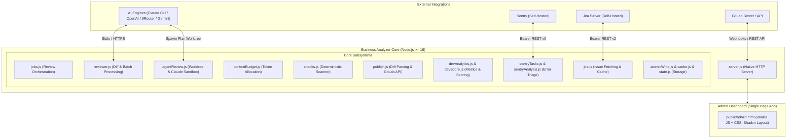
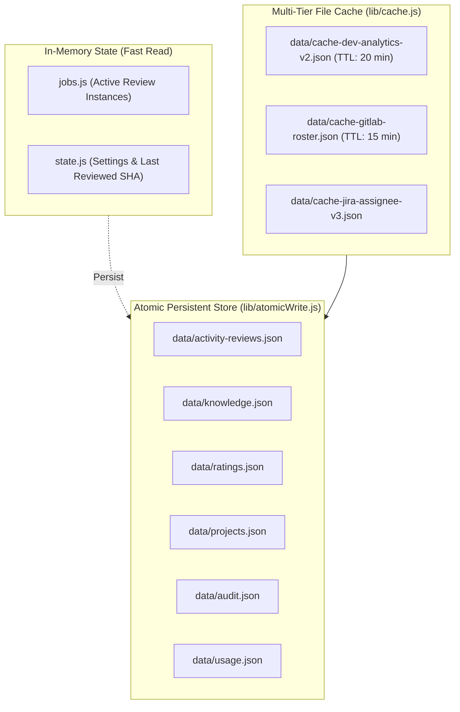

# 🏛️ Business Analyzer — Technical Architecture

This document provides an exhaustive, in-depth architectural breakdown of **Business Analyzer** (formerly *Coder Review*). It explores the system's core design philosophy, execution pipelines, data models, algorithm specifications, and security boundaries.

---

## 1. High-Level Architecture Overview

Business Analyzer is a unified, zero-dependency Node.js enterprise engine that delivers two complementary capabilities:
1. **Product A (Autonomous Code Review)**: Webhook- and polling-driven AI code reviews on GitLab Merge Requests with line-accurate discussions, deterministic security sweeps, and isolated agentic repository inspection.
2. **Product B (Engineering Performance Analytics)**: Automated evaluation of developer output, task delivery velocity, worklog discipline, code quality, Sentry error triage, and Jira progress tracking.



---

## 2. Core Design Philosophy

1. **Zero External Dependencies (`package.json: dependencies: {}`)**:
   - The entire system is built strictly using Node.js native standard libraries (`http`, `https`, `crypto`, `fs`, `child_process`, `path`, `os`).
   - Eliminates supply chain risks, dependency bloat, version drift, and deprecation vulnerabilities.
2. **Deterministic File-Based Persistence**:
   - No SQL or NoSQL database required.
   - All state, caches, audit logs, knowledge base articles, and activity logs reside in JSON files within the `data/` directory.
   - Writes are executed safely via atomic write replacements (`lib/atomicWrite.js`: write to a temporary file + atomic `fs.renameSync`).
3. **Dual-Path AI Review Architecture**:
   - **Agentic Worktree Sandbox (`lib/agentReview.js`)**: Executes `claude` CLI inside an isolated detached git worktree with strict read-only permissions (`--permission-mode plan`, allowlisting `Read`, `Grep`, `Glob`). Explores callers, implementations, and dependencies across the entire repository without touching the developer's working directory.
   - **Diff-Driven Batching (`lib/reviewer.js`)**: For HTTP-based providers (OpenAI-compatible, 9Router, Google Gemini), diffs are categorized, filtered, and packed into bounded batches up to engine-specific context budgets.
4. **Resilient Fallback Chains**:
   - If Claude CLI fails or encounters session/token exhaustion, the review seamlessly falls back to any configured HTTP AI engine.
   - If AI engines fail completely, deterministic machine checks (`lib/checks.js`) still run, flag critical security vulnerabilities, and generate the report.

---

## 3. Autonomous Code Review Pipeline

### 3.1 Review Lifecycle Flow

```mermaid
sequenceDiagram
    autonumber
    actor Dev as Developer
    participant GL as GitLab
    participant Srv as Business Analyzer
    participant Repo as Local Git Clone
    participant AI as AI Engine
    
    Dev->>GL: Push commit to MR
    alt Webhook Mode
        GL->>Srv: POST /webhook/gitlab (X-Gitlab-Token)
        Srv-->>GL: 200 OK (Immediate Ack)
    else Polling Mode
        Srv->>GL: Poll GET /api/v4/projects/:id/merge_requests
    end
    
    Srv->>Repo: git fetch origin refs/merge-requests/:iid/head
    
    alt Claude CLI Available
        Srv->>Repo: git worktree add ../.coder-review-worktrees/mr-:iid
        Srv->>AI: claude -p (Agent explores repo with Read/Grep/Glob)
        AI-->>Srv: JSON Report & Findings
        Srv->>Repo: git worktree remove
    else HTTP Engine Fallback
        Srv->>GL: Fetch MR Changes & Diffs
        Srv->>Srv: Filter non-source files & Deterministic Scans
        Srv->>Srv: Batch files via contextBudget.js
        Srv->>AI: Parallel HTTP Batch Requests (concurrency limit = 6)
        AI-->>Srv: Batch Findings
    end
    
    Srv->>Srv: Deduplicate findings & Determine Decision (APPROVE vs REQUEST_CHANGES)
    Srv->>Repo: Write local report review/MR-:iid.md
    opt Auto-Post Enabled
        Srv->>GL: Post inline discussions via exact line diff positions
        Srv->>GL: Post main MR summary note
    end
    opt Auto-Approve Enabled
        Srv->>GL: Check sequential merge order; approve if earlier MRs approved
    end
```

### 3.2 Diff Parsing and Line Anchor Positioning (`lib/diff.js` & `lib/publish.js`)

GitLab inline discussions require precise positional metadata:
- `base_sha`: Commit SHA on the target branch before the merge request.
- `start_sha`: Base commit SHA where the MR branch diverged.
- `head_sha`: Commit SHA of the latest commit on the MR branch.
- `old_line` / `new_line`: Exact line numbers corresponding to the hunk headers (`@@ -old,len +new,len @@`).
- `new_path` / `old_path`: File paths.

`lib/diff.js` parses raw diffs into line mappings. When the AI cites a file and line number:
1. `publish.js` verifies if the target line exists within the newly added or modified lines in that diff (`commentableLines`).
2. If verified, it compiles a structured `position` object and submits an inline `POST /projects/:id/merge_requests/:iid/discussions`.
3. If the model hallucinates a line number outside the diff or comments on an unchanged area, the finding is safely redirected to the general MR summary note under a dedicated section ("Findings with unconfirmed diff line"), preventing API 400 rejection.

### 3.3 Context Budgeting Algorithm (`lib/contextBudget.js`)

To prevent token overflow and HTTP 400 Bad Request errors, `lib/contextBudget.js` calculates model allocations dynamically:

| Provider | Window Size | Usable Context (70%) | Max Output Tokens | Batch Chars Budget |
| :--- | :--- | :--- | :--- | :--- |
| **claude-cli** | 200,000 | 140,000 | 8,192 | N/A (Agent Worktree) |
| **openai-compatible** | 128,000 | 89,600 | 4,096 | ~102,000 chars |
| **9router** | 32,000 | 22,400 | 2,048 | ~36,400 chars |
| **gemini** | 1,000,000 | 700,000 | 8,192 | ~800,000 chars |

**Key Rules:**
- Persian text (system prompts, Jira descriptions, Knowledge Base) is weighted at **1.2 characters/token**, whereas Latin code is budgeted at **3.6 characters/token**.
- Truncation is always performed on **clean line boundaries**; lines longer than the total budget are truncated internally with descriptive truncation markers.
- Omitted files and truncated sections are explicitly cataloged in the review report.

### 3.4 Deterministic Scans (`lib/checks.js`)

Independent of LLM inference, `lib/checks.js` executes instant regex-based deterministic audits:
- **Secret Scanning**: Scans for AWS tokens, private keys (`BEGIN RSA PRIVATE KEY`), GitHub/GitLab personal tokens (`glpat-`, `ghp_`), JWT tokens, and connection strings containing passwords.
- **Debug Leftovers**: Flags lingering `console.log`, `print()`, `debugger`, `var_dump`, and `@ts-ignore`.
- **Merge Conflict Markers**: Flags unresolved conflict tags (`<<<<<<<`, `=======`, `>>>>>>>`).
- **Missing Tests**: Triggers an alert if significant source code is changed without any accompanying changes in test files.
- **MR Size Guard**: Warns when diffs exceed 800 lines or 30 files, encouraging smaller atomic MRs.

---

## 4. Engineering Performance Analytics Engine

### 4.1 Mathematical Foundations (`lib/devScore.js`)

A developer's performance score $S \in [0, 100]$ is computed as the normalized weighted average of up to 6 operational components:

$$S = \frac{\sum_{i=1}^{M} w_i \cdot c_i \cdot s_i}{\sum_{i=1}^{M} w_i \cdot c_i}$$

Where:
- $s_i \in [0, 100]$ is the raw score of metric $i$.
- $w_i$ is the nominal weight assigned to metric $i$.
- $c_i \in [0, 1]$ is the sample size confidence factor.
- Metrics with zero sample data ($n = 0$) are entirely omitted, and their weights are redistributed proportionally across the remaining active metrics.

#### Metrics Breakdown

| Component ($i$) | Weight ($w_i$) | Sample Size ($n$) | Confidence Factor ($c_i$) | Description & Computation |
| :--- | :--- | :--- | :--- | :--- |
| **On-Time Delivery** | 25 | Total Jira tasks with due dates | $\frac{n}{n + 5}$ | Ratio of tasks completed by their Jira `duedate`. Late tasks are penalized proportionally to overdue days. |
| **Estimation Accuracy** | 25 | Tasks with estimate & time spent | $\frac{n}{n + 5}$ | Symmetric $\log_2$ penalty: compares `originalestimate` vs `timespent`. Over- and under-estimations are penalized symmetrically. |
| **Code Quality** | 20 | Total reviewed MRs | $\frac{n}{n + 5}$ | Findings from the latest review of each MR, normalized by the square root of the file count: $\frac{\text{weighted findings}}{\sqrt{\text{files}}}$. |
| **Task Completion** | 15 | Total assigned Jira tasks | $\frac{n}{n + 5}$ | Ratio of `Done` / `Resolved` tasks to total tasks within the evaluated date range. |
| **Worklog Discipline** | 10 | Tasks in Review or Done | $\frac{n}{n + 5}$ | Percentage of completed or in-review tasks that have non-zero logged work hours. |
| **Single-Author Branch**| 5 | MRs with local review reports | $\frac{n}{n + 5}$ | Percentage of MR branches containing commits exclusively authored by the MR creator. |

#### Complexity Adjustment Factor
Scores can be adjusted by a complexity modifier up to $\pm 12$ points based on maintainer ratings (`C*` complexity and `L*` length).

---

## 5. Storage and Caching Architecture



### 5.1 Atomic Write Guarantee
Direct calls to `fs.writeFileSync` risk file corruption during unexpected power outages or process termination. `lib/atomicWrite.js` guarantees data integrity:
1. Data is written to `${filePath}.tmp.${Date.now()}.${crypto.randomBytes(4).toString('hex')}`.
2. An atomic `fs.renameSync` replaces the target file in a single OS kernel operation.
3. If an error occurs during preparation, the temporary file is deleted without modifying the original.

### 5.2 Backup Subsystem (`lib/backup.js`)
- Executes automated backups of all files in `data/` and `secrets.env` to `backups/YYYY-MM-DD-HHmmss/`.
- Runs automatically 60 seconds after server launch and every 24 hours thereafter.
- Maintains rolling retention, automatically pruning old snapshots beyond retention limits.

---

## 6. Security Model & Boundaries

1. **Localhost Trust Model (`isLocal`)**:
   - When running on `127.0.0.1` or `::1`, administrative endpoints allow access without requiring an `ADMIN_TOKEN`.
   - **Reverse Proxy Warning**: If deployed behind a reverse proxy (Nginx, Caddy, Cloudflare Tunnel), all forwarded connections appear as `127.0.0.1`. In this topology, `ADMIN_TOKEN` must be explicitly configured in `secrets.env`.
2. **GitLab Webhook Verification (`verifyWebhookToken`)**:
   - Webhook requests must provide the matching `X-Gitlab-Token` header corresponding to `WEBHOOK_SECRET`.
3. **Restricted Shell Execution**:
   - When Claude CLI or git operations are invoked, arguments are passed as discrete token arrays rather than interpolated shell strings, preventing shell injection vulnerabilities.
   - Worktree environments execute under detached HEAD states without checking out or modifying user branches.
