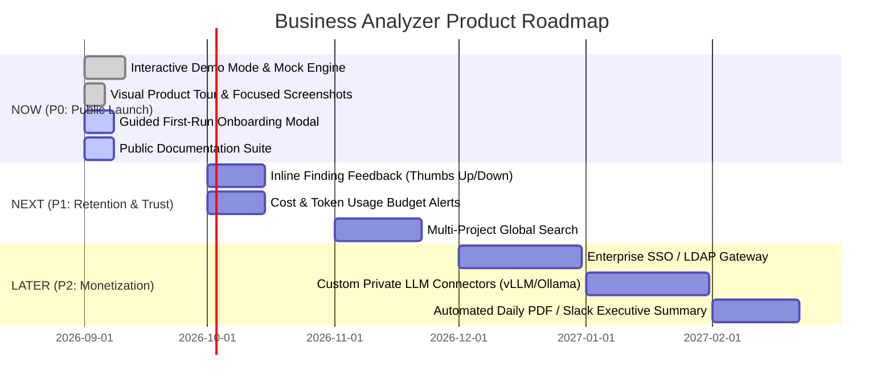

# 🗺️ Business Analyzer — Strategic Product Roadmap

This roadmap balances immediate user acquisition with long-term enterprise monetization, prioritized using the **ICE Score** ($\text{Impact} \times \text{Confidence} \div \text{Effort}$).

---

## 1. Roadmap Phasing

---

## 2. ICE Prioritization Matrix

| Feature | Impact (1–10) | Confidence (1–10) | Effort (1–10) | ICE Score | Priority |
| :--- | :---: | :---: | :---: | :---: | :--- |
| **Interactive Demo Mode (`?demo=1`)** | 9 | 10 | 2 | **45.0** | **NOW (P0)** |
| **Guided First-Run Onboarding Flow** | 8 | 9 | 3 | **24.0** | **NOW (P0)** |
| **Focused Component Screenshots** | 8 | 9 | 2 | **36.0** | **NOW (P0)** |
| **Inline Finding Feedback (👍/👎)** | 7 | 8 | 3 | **18.7** | **NEXT (P1)** |
| **Token Cost Soft-Caps & Warnings** | 7 | 7 | 3 | **16.3** | **NEXT (P1)** |
| **Slack / Teams Digest Webhook** | 6 | 7 | 4 | **10.5** | **NEXT (P1)** |
| **Enterprise SSO & SAML Auth** | 9 | 6 | 8 | **6.75** | **LATER (P2)** |
| **Private Ollama / Local LLM Bridge**| 8 | 7 | 5 | **11.2** | **LATER (P2)** |

---

## 3. Features to AVOID for Now 🚫

1. **Complex Multi-Tenant Cloud SaaS Infrastructure**:
   - *Why Avoid*: Premature optimization. Hosting customer code creates huge liability, security friction, and GDPR overhead. Self-hosted single-node satisfies our ICP immediately.
2. **Automated Code Fixing / PR Writing (Auto-Refactoring)**:
   - *Why Avoid*: High hallucination risk. Developers dislike bots opening unwanted pull requests with unvetted code. Keep focus on review and intelligence.
3. **Complex Billing Microservices & Stripe Gateways**:
   - *Why Avoid*: Early B2B enterprise deals are closed via invoices, wire transfers, and annual contracts. Stripe integration can wait until organic volume demands it.
