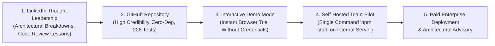

# 🎯 Business Analyzer — Comprehensive Product Strategy

> **Author**: Lead Product Engineer, Architect & Growth Strategist  
> **Product Owner**: Javid Sattar — Senior Software Engineer & Independent Product Builder  
> **Repository**: [https://github.com/javiddeveloper/Business-Analyzer](https://github.com/javiddeveloper/Business-Analyzer)  
> **Strategic Intent**: Transform Business Analyzer from an internal power tool into a credible, marketable, self-hosted B2B software product capable of generating recurring revenue and expanding developer consulting engagements.

---

## 1. The Concrete Problem Space

### 1.1 The Actual Engineering & Managerial Pain

Engineering leaders at growing software teams (10–100 engineers) suffer from two chronic, interconnected bottlenecks:

1. **The Code Review Chokepoint**:
   - Senior engineers and Tech Leads spend 10–25 hours per week reviewing pull requests.
   - Despite this massive investment of senior time, human reviews suffer from fatigue: credential leaks, subtle concurrency bugs, and missing unit tests frequently slip into production branches.
   - When leads are constrained, pull requests sit idle for 3–5 days, stalling delivery velocity and frustrating product managers.
2. **Fragmented Engineering Blindness**:
   - Engineering metrics live in silos: Code lives in **GitLab**, task progress lives in **Jira**, and production errors live in **Sentry**.
   - Engineering Managers waste hours every sprint manually reconciling:
     - *"Are tickets marked 'In Progress' actually being worked on?"*
     - *"Why did this merge request take 6 days to get merged?"*
     - *"Which production crashes in Sentry are actually tied to active Jira sprints?"*
     - *"Who is overburdened and who has bandwidth this morning?"*

### 1.2 Current Alternatives & Why They Fail

| Alternative | What It Is | Why It Fails for Mid-Market & Enterprise Teams |
| :--- | :--- | :--- |
| **Manual Senior Reviews** | Senior engineers review every line manually. | **Expensive & Unscalable**: 15+ hours/week of senior engineer time ($120k–$200k/yr salaries) wasted on routine linting, credential sweeps, and basic logic verification. |
| **SaaS Review Bots (CodeRabbit, Qodo)** | Cloud-hosted PR bots analyzing diffs via public cloud APIs. | **Security & Privacy Dealbreaker**: Cloud-only bots require sending source code to third-party US cloud servers. Heavily regulated enterprises, European teams (GDPR), and self-hosted GitLab installations cannot approve them. |
| **Heavy Engineering Analytics (LinearB, Jellyfish)** | Enterprise engineering intelligence suites. | **Bloated & Disconnected**: Costs $30k–$80k/year, requires extensive onboarding, and only provides high-level executive dashboards without actionable code-level review or error resolution. |
| **SonarQube / Static Analysis** | AST-based static code analyzers. | **No Contextual Intelligence**: Flags thousands of pedantic formatting warnings while missing deep multi-file business logic flaws, race conditions, and Jira ticket misalignment. |

### 1.3 The Business Analyzer Solution

Business Analyzer bridges this gap with a **single, self-hosted, zero-dependency engine**:
- **Autonomous, Deep AI Code Review**: Reviews MRs using isolated agentic git worktrees (`claude-cli`) that traverse the entire repository tree, catching cross-file bugs and credential leaks before human leads even open the diff.
- **Unified Actionable Intelligence**: Automatically correlates GitLab MRs, Jira worklogs, and Sentry crashes into an actionable morning priority dashboard.
- **Zero Cloud Footprint**: Runs completely on-premise or on a private virtual server with zero external npm dependencies. Code and credentials never leave the organization's boundary.

---

## 2. Ideal Customer Profiles (ICPs)

### ICP A: Engineering Manager / Head of Engineering
- **Team Size**: 8 to 40 engineers across 2–5 squads.
- **Core Pain**: Constantly interrupted by blocked PRs; lacks visibility into real sprint progress; relies on unreliable subjective opinions during 1:1 performance evaluations.
- **Desired Outcome**: Cut PR turnaround times from 72h to under 12h; establish objective, transparent, defensible developer growth metrics without micromanagement.
- **Why They Would Use This**: Provides immediate clarity on *"Who needs attention this morning?"* without logging into Jira, GitLab, and Sentry separately.
- **Buying Trigger**: PR backlog explodes after a hiring sprint; executive pressure over delayed quarterly releases.
- **Primary Objections**: *"Will my team think this is a Big Brother surveillance tool?"*

### ICP B: CTO / Technical Founder
- **Company Size**: 15 to 80 employees (Series A to Series C).
- **Core Pain**: Vulnerability to catastrophic credential leaks; escalating AWS/cloud costs; high senior developer turnover driven by review burnout.
- **Desired Outcome**: Standardize engineering standards across all microservices; protect corporate IP; prevent leaked secrets from reaching production.
- **Why They Would Use This**: Zero external npm dependencies and self-hosted architecture satisfies strict internal security compliance.
- **Buying Trigger**: A production outage caused by an unreviewed PR, or a failed security audit.

### ICP C: Self-Hosted GitLab & Jira Enterprise Teams (The Primary ICP)
- **Profile**: Financial services, healthtech, telecommunications, government, or infrastructure companies running self-hosted GitLab Server/CE/EE and Jira Data Center behind firewalls.
- **Core Pain**: Completely locked out of modern cloud-hosted SaaS developer tools (like GitHub Copilot Cloud, CodeRabbit, LinearB) due to strict data sovereignty and security policies.
- **Desired Outcome**: Bring modern LLM intelligence and team analytics into their private, air-gapped or VPC infrastructure without security compliance pushback.
- **Why They Pay**: They have substantial enterprise budgets and zero viable off-the-shelf alternatives that run on-premise without cloud lock-in.

---

## 3. Value Proposition & Positioning

### 3.1 Value Statements
- **One-Line Value Proposition (13 Words)**:  
  *Automate GitLab code reviews and engineering team analytics completely inside your private infrastructure.*
- **Short Description (46 Words)**:  
  *Business Analyzer is a self-hosted engineering intelligence platform that conducts deep AI code reviews on GitLab merge requests, catches security vulnerabilities deterministically, and correlates Jira tasks and Sentry crashes into an actionable management dashboard—all with zero external npm dependencies.*

### 3.2 Landing Page Headline Alternatives
1. *"Autonomous Code Reviews and Engineering Analytics for Private GitLab Teams."*
2. *"Ship Clean Code Faster Without Burning Out Your Senior Engineers."*
3. *"The Self-Hosted Engineering Intelligence Engine for GitLab, Jira, and Sentry."*

### 3.3 Product Positioning Matrix

| Candidate Category | Strengths | Weaknesses | Decision |
| :--- | :--- | :--- | :--- |
| **A. AI Code Review Platform** | Clear consumer mental model; immediate developer appeal. | Ignores the high-value Sentry, Jira, and developer analytics capabilities. | *Too narrow.* |
| **B. Developer Performance Analytics** | Appeals to HR and executive buyers. | Provokes engineer pushback if positioned purely as employee monitoring. | *Too polarizing.* |
| **C. Self-Hosted Engineering Intelligence** | Unifies code quality, delivery velocity, and production stability under one defensible banner. | Slightly broader category definition. | **SELECTED PRIMARY POSITIONING** |

---

## 4. Competitive Landscape

```
                          [Self-Hosted / High Privacy]
                                       |
                                       |   ★ BUSINESS ANALYZER
                                       |   (Self-Hosted, Code Review +
                                       |    Jira/Sentry Analytics, Zero-Dep)
                                       |
                   SonarQube           |
                   (Static AST Only)   |
                                       |
[Static / AST Checks] -----------------+----------------- [AI Contextual / Deep Reasoning]
                                       |
                   LinearB /           |   CodeRabbit / Qodo
                   Jellyfish           |   (Cloud-Only AI PR Bots)
                   (Cloud DORA Stats)  |
                                       |
                            [Cloud SaaS / Third-Party]
```

### Competitor Analysis & Market Gaps
- **Direct Competitors**: CodeRabbit, Qodo (CodiumAI).  
  *Gap*: Exclusively cloud-native; cannot inspect detached local worktrees inside private enterprise VPCs.
- **Adjacent Competitors**: LinearB, Swarmia, Jellyfish.  
  *Gap*: High-level executive dashboards without code-level review or real-time Sentry bug resolution.
- **Internal / Manual Alternatives**: Tech Lead manual review hours and Excel sprint tracking.  
  *Gap*: Massive developer burnout and non-standardized evaluation standards.

---

## 5. Tier Definitions & Feature Breakdown

| Tier | Price Point | Target Audience | Key Capabilities |
| :--- | :--- | :--- | :--- |
| **Community / Free** | **$0** (Open Source) | Individual Developers & Small Teams (<5 devs) | Local CLI execution, 1 active project, basic diff reviews (OpenAI/Gemini), interactive Demo Mode, community support. |
| **Team / Pro** | **$29** / seat / month | Growing Engineering Teams (5–25 devs) | Unlimited repositories, Claude CLI Agentic Worktree inspection, GitLab Webhooks & Auto-polling, Sentry triage, Jira sync, full analytics. |
| **Enterprise** | **Custom** ($5k–$25k/yr) | Regulated Enterprises & Mid-Market (25–250 devs) | Self-hosted on-premise installation, custom LLM fine-tuning, SLA guarantees, audit logging, custom ERP/HR integrations, direct advisory from Javid Sattar. |

---

## 6. The LinkedIn → GitHub → Customer Funnel



1. **Top of Funnel (LinkedIn)**: Javid Sattar shares authentic, technical case studies on software architecture, code review automation, avoiding LLM hallucinations, and managing engineering teams.
2. **Evaluation Asset (GitHub)**: Technical readers click through to the GitHub repository. They are greeted with a professional README, clear screenshots, clean architecture, and 226 passing tests.
3. **Frictionless Activation (Demo Mode)**: Visitors run `http://localhost:8078/admin?demo=1` or run the docker/npm command and immediately experience the full product with rich synthetic enterprise data—no GitLab API tokens required.
4. **Team Adoption**: Tech Leads easily install it on their private server in under 5 minutes due to zero npm dependencies.
5. **Commercial Conversion**: When teams need multi-project deployments, custom LLM integration, or compliance sign-offs, they engage Javid Sattar for commercial enterprise licensing and custom engineering solutions.
