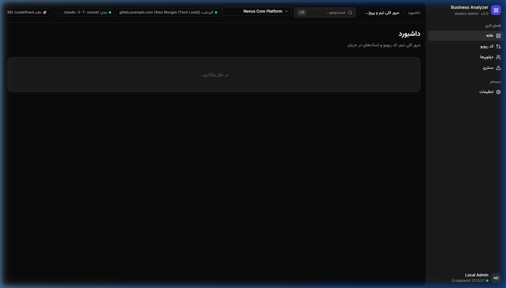
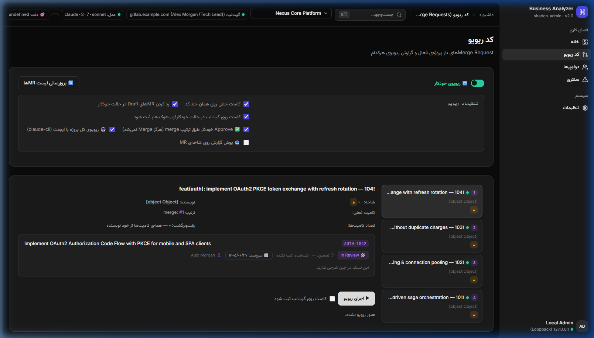
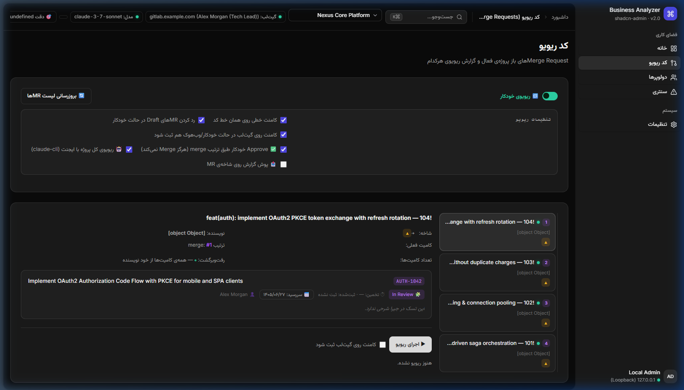
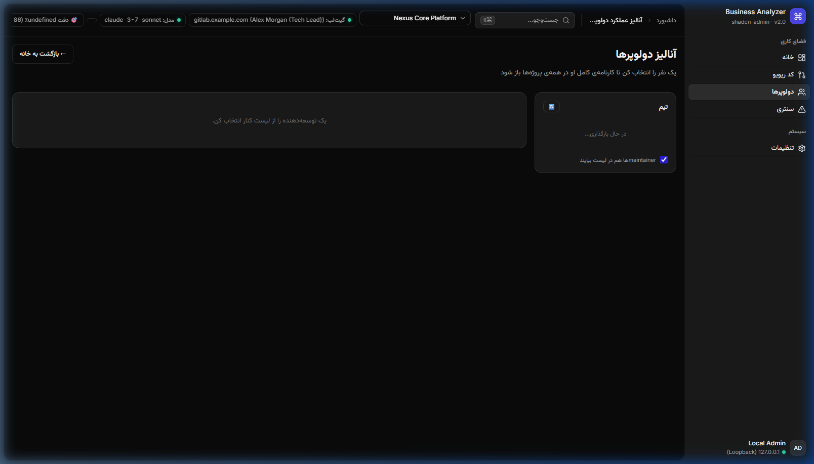
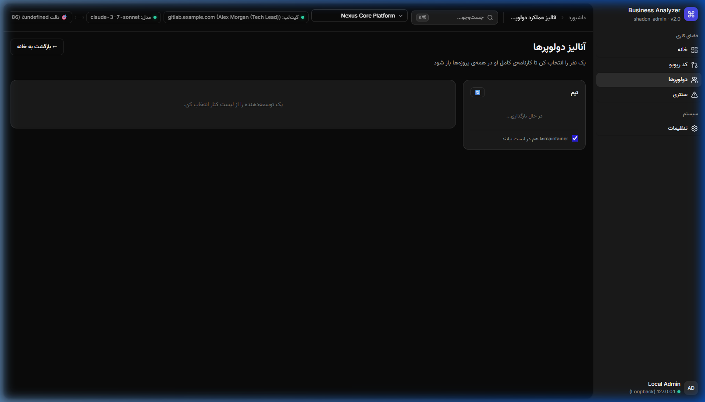
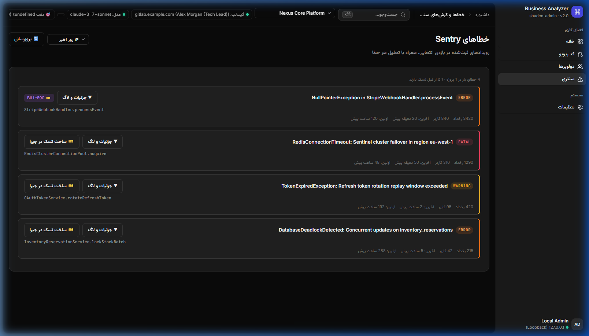
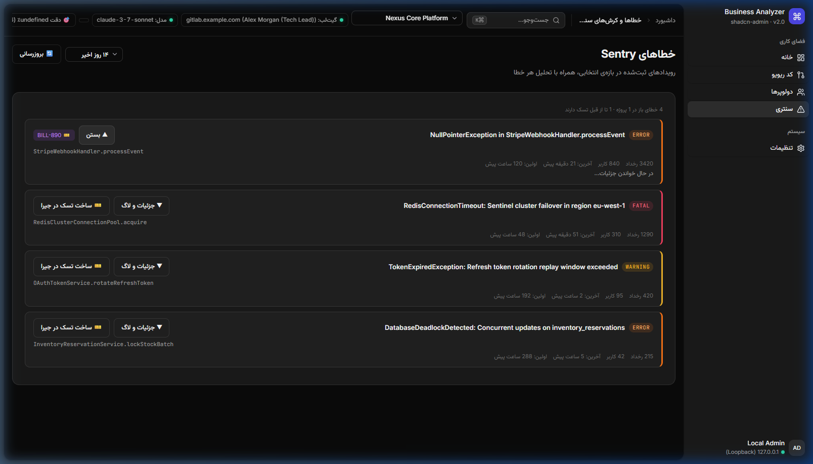

# 📸 Business Analyzer — Visual Product & Architecture Tour

This document provides a guided visual walkthrough of **Business Analyzer**'s core interfaces and operational workflows using focused component screenshots with synthetic mock data.

---

## 1. Global Header & Engine Orchestration

The top command toolbar keeps engineering leaders informed of system status, active repository contexts, and AI inference engines at a single glance.

### Key Architectural Elements
- **Active Project Selector**: Dynamic dropdown switching between registered GitLab repositories (`Nexus Core Platform`, `Cloud Billing & Payments`, `Identity Gateway`).
- **AI Engine Pill**: Displays the active inference provider (`claude-3-7-sonnet`) and connection health. One click opens the fast engine switcher.
- **Auto-Review & Approval Indicators**: Real-time status badges showing polling cadence and sequential merge-order auto-approval rules.
- **Global Navigation**: Quick access to **Overview**, **Merge Requests (Code Review)**, **Developer Analytics**, **Sentry Triage**, and **Settings (⚙)**.

---

## 2. Workspace Overview & Team Health

The primary operational dashboard provides engineering managers with an instant answer to: *"What is happening across our engineering team right now?"*

### Key Capabilities
- **Attention Priority Sorting**: Engineers with blocking items (overdue tasks, stale reviews >72h, missing worklogs) are automatically sorted to the top.
- **Cross-Repository Aggregation**: Synthesizes open merge requests across multiple projects into a unified view.
- **Delivery Velocity**: Displays median hours-to-merge and active sprint progress across team members.

---

## 3. Merge Request Sidebar & Merge Order Queue

Merge Requests are displayed as vertical tabs arranged chronologically by creation date—the exact sequence in which they should be merged.

### Workflow & Safety Features
- **Sequential Merge-Order Indicator**: Purple badge (`#1`, `#2`, `#3`) indicating exact queue position.
- **Target Branch Visual Pill**: Green for `develop`, orange for `main` or hotfix branches to instantly flag accidental merges into production branches.
- **Deterministic Task Extraction**: Automatically parses task identifiers (e.g., `AUTH-1042`, `BILL-890`, `PERF-401`) from branch names or MR titles.
- **Live Review State**: Real-time pulsing cyan for in-progress reviews, green for `APPROVE`, red for `REQUEST_CHANGES`.

---

## 4. Autonomous AI Code Review Panel

Selecting a Merge Request renders its comprehensive review dossier, combining deterministic regex scans with deep LLM inference.

### Review Structure
- **Summary & Decision Header**: Explicit binary verdict (`APPROVE ✅` or `REQUEST_CHANGES 🔴`) derived deterministically from findings severity rather than model sentiment.
- **Positive Observations ✨**: Architectural highlights, clean abstractions, and robust testing patterns acknowledged by the AI.
- **Actionable Findings 🔍**: Categorized into High, Medium, and Low severity with exact file paths, line numbers, and concrete remediation advice.
- **Direct GitLab Discussion Anchors**: When published, comments are converted into line-accurate discussions directly on the GitLab diff.

---

## 5. Developer Roster & Team Directory

The developer roster catalog lists all engineers contributing to the organization's repositories, synchronized directly with GitLab access levels.

### Roster Management
- **Role-Based Filtering**: Distinguishes between Developers, Maintainers, and Owners.
- **Live Workload Badges**: Real-time counters showing active tasks in progress and pending reviews.
- **Attention Badges**: Red indicators alerting managers when a developer has stalled reviews or overdue commitments.

---

## 6. Developer Performance Scorecard

Opening an engineer's dossier reveals a comprehensive 6-factor evaluation calibrated with sample-size confidence discounting.

### The 6 Balanced Metrics
1. **On-Time Delivery (25%)**: Proportional penalty based on days past Jira due date.
2. **Estimation Accuracy (25%)**: Symmetric $\log_2$ penalty balancing under- and over-estimation.
3. **Code Quality (20%)**: Review findings normalized by the square root of modified files ($\frac{\text{findings}}{\sqrt{\text{files}}}$).
4. **Task Completion (15%)**: Ratio of Resolved/Done tasks during the sprint cycle.
5. **Worklog Discipline (10%)**: Percentage of completed tasks with logged work hours.
6. **Single-Author Branch (5%)**: Ratio of branches authored exclusively by the developer.

---

## 7. Sentry Production Error Triage

The Sentry integration continuously monitors production crashes, allowing teams to prioritize and resolve critical errors directly from the dashboard.

### Triage Matrix
- **Severity Classification**: Categorized into Fatal, Error, and Warning.
- **Impact Metrics**: Real-time event frequencies and total unique user counts affected.
- **Bidirectional Jira Tracking**: Displays linked Jira task keys (e.g., `BILL-890`) directly next to the crash.

---

## 8. Stacktrace Analysis & AI Root Cause Diagnosis

Expanding any Sentry crash displays its stacktrace alongside an automated AI interpretation and recommended fix.

### AI Assistance
- **Root Cause Summary**: Concise explanation of the underlying failure mode without requiring manual log archaeology.
- **One-Click Jira Task Creation**: Automatically pre-populates a structured Jira task with appropriate priority, time estimate, and assignee recommendation.
